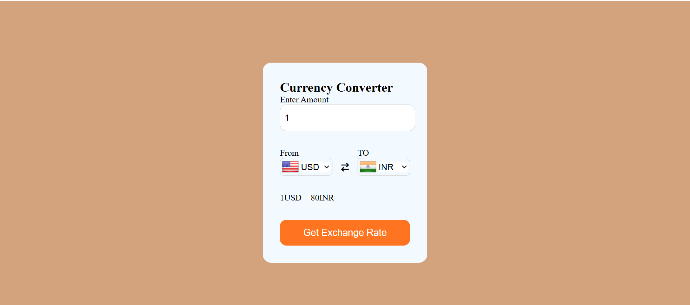

# Currency Converter

This is a simple and responsive currency converter web application built using HTML, CSS, and JavaScript. It allows users to convert one currency to another using real-time exchange rates from a free API.

## Features

- Real-time currency conversion
- User-friendly and responsive design
- Country flags for selected currencies
- Uses a free currency API to fetch exchange rates

## Technologies Used

- HTML
- CSS
- JavaScript
- Currency API: [fawazahmed0/currency-api](https://github.com/fawazahmed0/currency-api)

## Screenshot

<!-- Use ./scr.png if the image is not inside an "image" folder -->

## How to Run the Project

1. Clone the repository:

git clone https://github.com/your-username/currency-converter.git
cd currency-converter

2. Open the `index.html` file in your browser:

- On **Windows**:
start index.html

- On **macOS**:
open index.html

Or simply right-click on the `index.html` file and choose **"Open with browser"**.

## Note

- An active internet connection is required to fetch live exchange rates.
- Ensure that the screenshot file (`scr.png`) is placed correctly based on the path used.

## License

This project is open-source and free to use.
